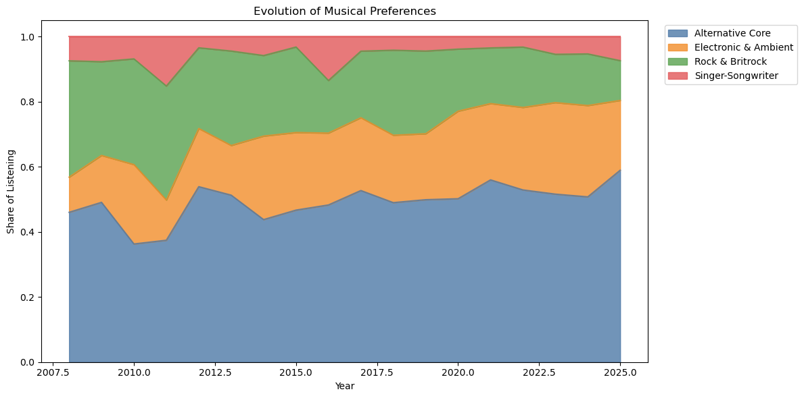
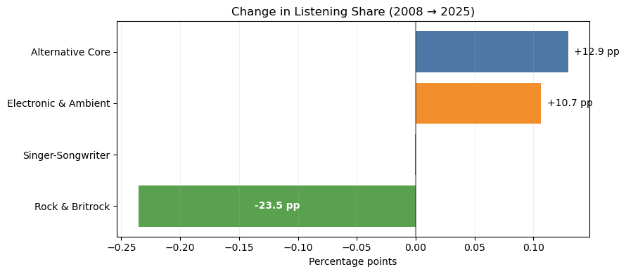
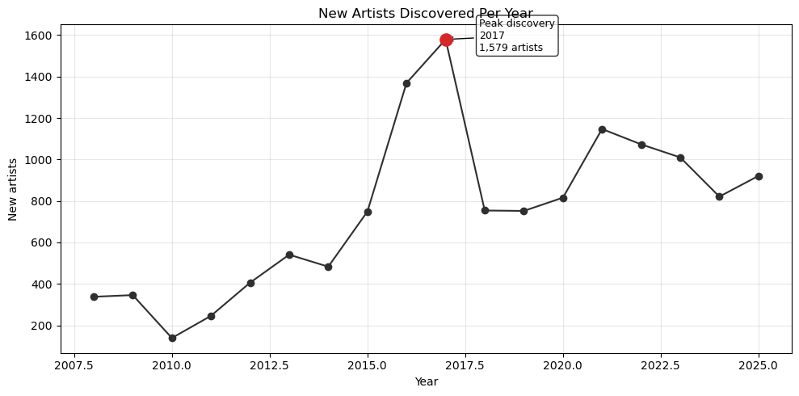
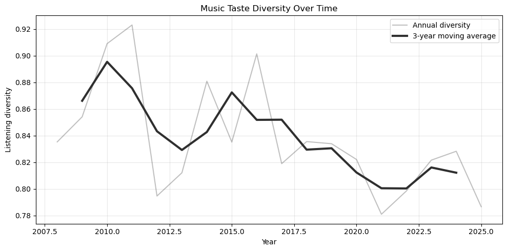
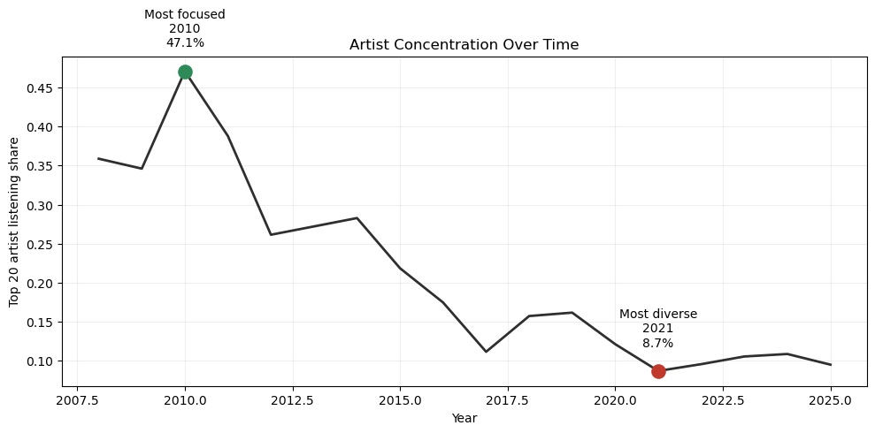
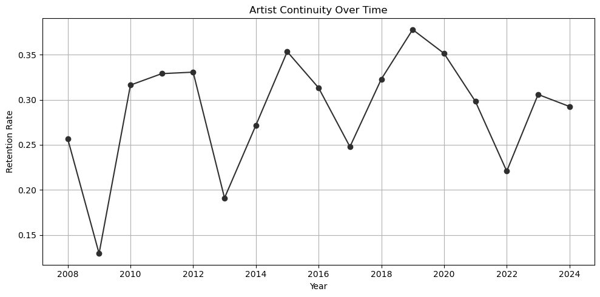

# Music Taste Evolution (2007–2026)

This project explores 19 years of personal listening history using Last.fm data, genre-tag enrichment, TF-IDF vectorization, UMAP projection and clustering techniques. The goal was to understand how musical preferences evolved over time and identify long-term trends in discovery, diversity and genre composition.

## Highlights

- 72,823 Last.fm scrobbles spanning 19 years
- 14k unique artist–track combinations
- Genre enrichment using Last.fm API
- TF-IDF + TruncatedSVD + K-Means + UMAP workflow
- Longitudinal analysis of music discovery and genre evolution

## Technologies

- Python
- pandas
- NumPy
- scikit-learn
- UMAP
- matplotlib
- Last.fm API

## Problem statement

The purpose of this experiment was to analyse the evolution of musical preferences over the last 19 years, based on 72k Last.fm records and 14k unique artist–track combinations enriched with genre metadata. Although the listening history spans 2007–2026, only complete years (2008–2025) were included in the temporal analyses to avoid sampling bias.

## Analytical unit

Temporal analyses are based on unique artist–track combinations rather than scrobble counts.
This allows the experiment to focus on repertoire evolution and music discovery patterns instead of listening frequency.

## Data collection

**Data sources**
- Last.fm export
- Last.fm API

**Dataset**
- 72,823 scrobbles (2007–2026)

**Analytical unit**
- Unique artist–track combinations after cleaning and normalization

## Experiment pipeline
```
Last.fm Export  
↓  
Cleaning & Normalization  
↓  
Tag Enrichment  
↓  
Feature Preparation
↓  
TF-IDF Vectorization  
↓  
TruncatedSVD
↓  
UMAP Projection  
↓  
K-Means Clustering  
↓  
Temporal Analysis
```

## Data cleaning

Data cleaning for this experiment involved:
- Track title normalization  
- Artist name normalization  
- Deduplication to unique artist-track combinations  
- Removal of tag metadata and noise  
- Synonym mapping and tag standardization

## Data clustering

Genre tags were transformed into TF-IDF vectors. The resulting feature space was reduced using TruncatedSVD for clustering and projected with UMAP for visualization. Initial K-Means clusters were manually reviewed and consolidated into four interpretable macro-categories used throughout the temporal analysis.

| Cluster              | Description                             |
| -------------------- | --------------------------------------- |
| Alternative Core     | alternative rock, indie rock, post-punk |
| Rock & Britrock      | classic rock, britpop, garage rock      |
| Electronic & Ambient | ambient, trip-hop, dream pop            |
| Singer-Songwriter    | folk, acoustic, singer-songwriter       |

## Analysis

### 1. Evolution of musical preferences



The musical repertoire became increasingly centered around Alternative Core and Electronic & Ambient music, while Rock & Britrock steadily declined. Despite these shifts, Alternative Core remained the dominant category throughout the entire period.



Between 2008 and 2025, listening shifted away from Rock & Britrock (-23.5 pp) toward Alternative Core (+12.9 pp) and Electronic & Ambient (+10.7 pp), while Singer-Songwriter preferences remained stable.

**Key findings**

• Alternative Core remained the largest listening category throughout the period.

• Electronic & Ambient more than doubled its listening share.

• Rock & Britrock lost over 20 percentage points between 2008 and 2025.

• Singer-Songwriter preferences remained relatively stable.

### 2. New artists discovered per year (music discovery)



Early years (2008-2014) were characterized by active exploration and gradual expansion of the listening library. Discovery activity peaked between 2016 and 2017, with more than 1,500 newly explored artists in a single year. Although discovery activity declined after the peak, it remained stable and significantly higher than during the first years of listening history.

This raises an interesting question: did increased music discovery translate into greater diversity of musical preferences?

### 3. Music taste diversity over time



Diversity was measured using normalized Shannon entropy calculated on yearly macro-cluster distributions of unique artist–track combinations. Higher values indicate a more balanced distribution across musical categories.
Listening diversity peaked around 2010–2011 and remained relatively stable for nearly a decade. After 2020, diversity gradually declined as listening became increasingly concentrated around Alternative Core and Electronic & Ambient music.

### 4. Artist concentration over time

How much of the yearly repertoire was represented by my top 20 artists?



The annual repertoire became progressively less concentrated around a small group of recurring artists. The share of the yearly repertoire represented by the top 20 artists fell from 47% in 2010 to below 10% in 2021, reflecting a broader and more exploratory listening pattern.

### 5. Top artists by era

How did these shifts manifest in the listening repertoire?

| Era       | Representative genres           | Example artists                                                   |
| --------- | ------------------------------- | ----------------------------------------------------------------- |
| 2008-2011 | Alternative rock & post-grunge  | RHCP, Placebo, Radiohead                                          |
| 2012-2016 | Classic alternative & new wave  | Kate Bush, New Order, Depeche Mode                                |
| 2017-2021 | Post-punk & songwriter revival  | The Cure, Nick Cave & the Bad Seeds, PJ Harvey, David Bowie       |
| 2022-2025 | Dream pop & ambient exploration | Japanese Breakfast, Men I Trust, Boards of Canada, The Radio Dept |

### 6. Artist retention over time

How often do artists remain part of the yearly repertoire from one year to the next?



Artist continuity remained relatively stable throughout the years. While a core group of artists persisted across consecutive years (25-35%), the majority of the repertoire was regularly refreshed with newly explored music.

### Conclusions

- Music discovery peaked in 2017 and remained consistently high afterwards.
- The size of the explored music catalogue expanded substantially over time, growing from a few hundred to more than two thousand artists per year.
- Rock-oriented repertoire gradually declined, while electronic and ambient-oriented music became increasingly prominent.
- Musical preferences became more distributed across a broader set of artists and genres over time.
- Despite substantial changes in genre composition, a stable alternative core remained present throughout the entire period.
- Despite continuous discovery of new artists, roughly one quarter to one third of the yearly repertoire remained stable from year to year.

## Data availability

Raw Last.fm exports and intermediate datasets are excluded from version control because they contain personal listening history and generated artifacts.

## Reproducibility

The notebooks should be executed in the following order:

```
1. 01_lastfm_rawmerging.ipynb
2. 02_lastfm_cleaning.ipynb
3. 03_lastfm_tags_enrichment.ipynb
4. 04_lastfm_tag_normalization.ipynb
5. 05_lastfm_tags_clustering.ipynb
6. 06_lastfm_clusters_visualization.ipynb
7. 07_music_taste_evolution.ipynb
```

