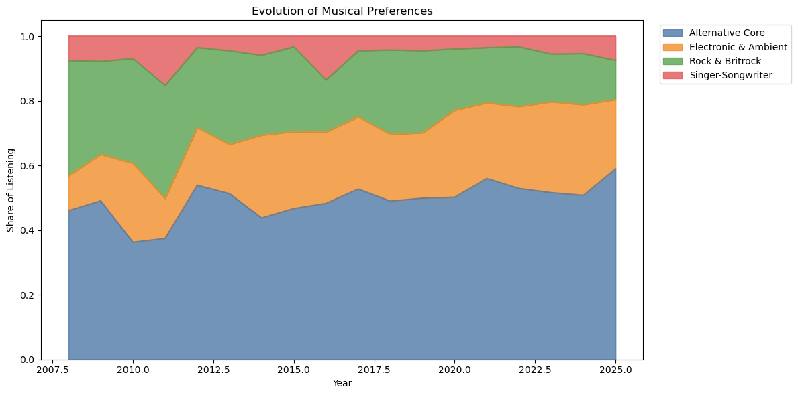
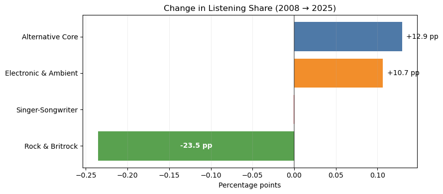
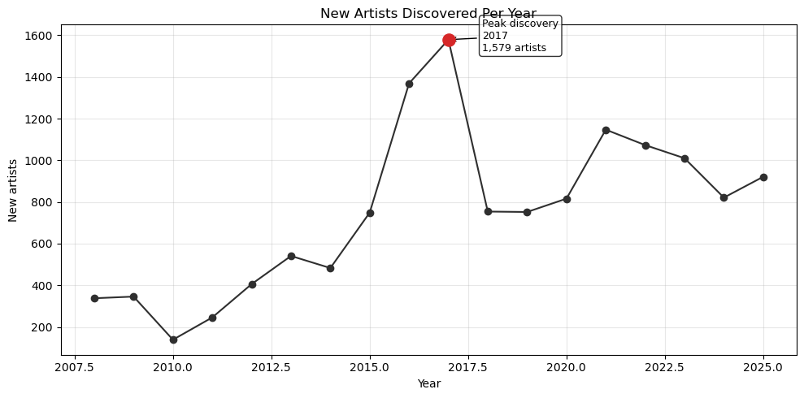
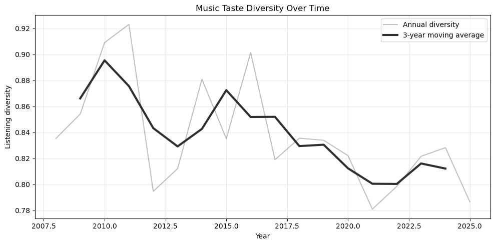
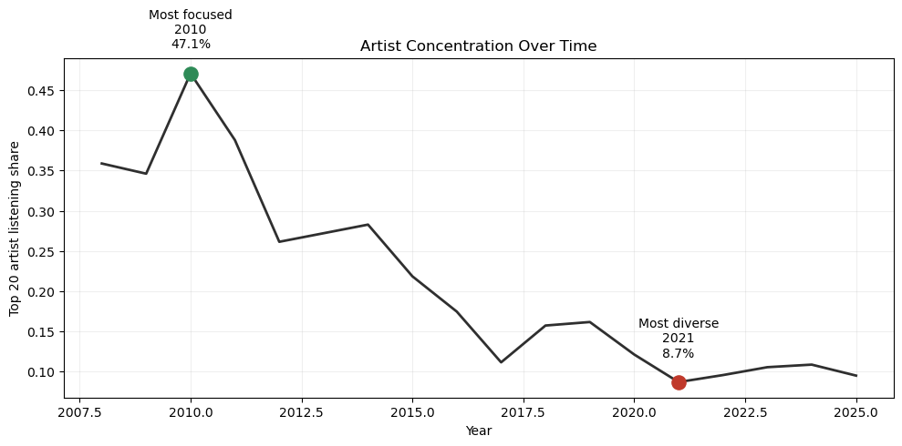
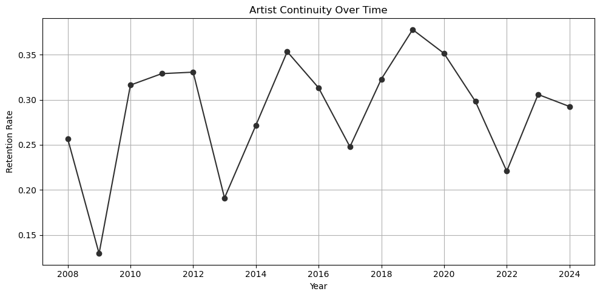
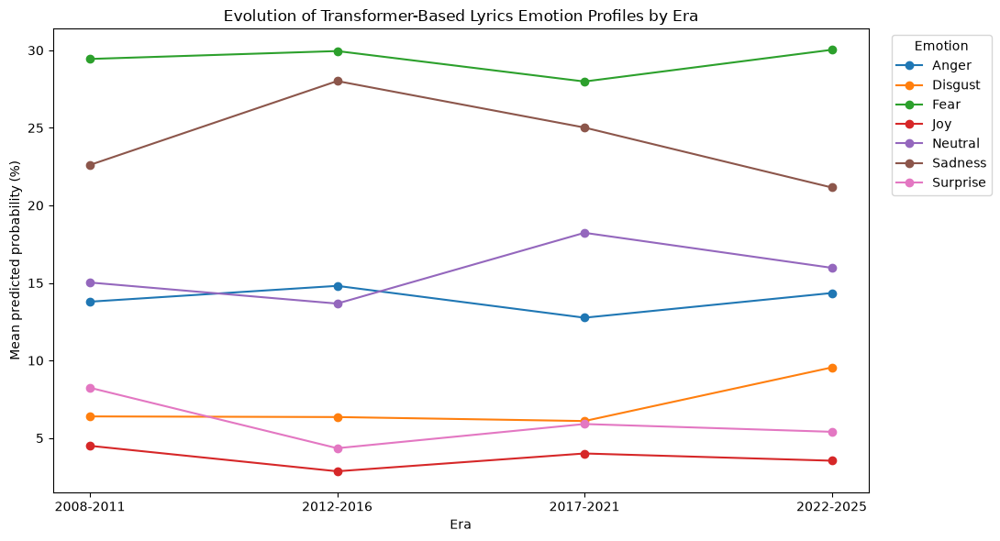
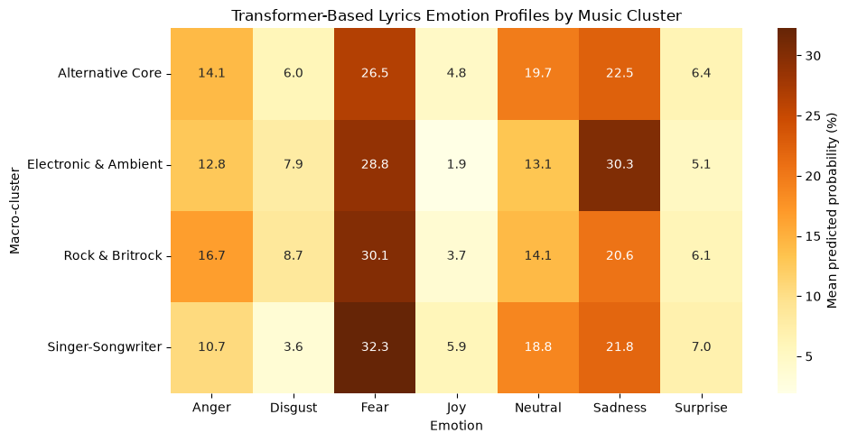
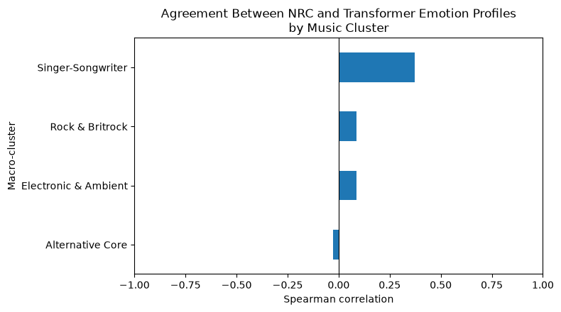

# Music Mood Profiler

**Music Mood Profiler** is a personal music analytics project built on Last.fm listening history and song lyrics.

The repository explores two complementary dimensions of long-term music taste:

1. **Music Taste Evolution (2007–2026)** — changes in genre composition,
   music discovery, diversity, artist concentration and retention.
2. **Lyrics Sentiment & Emotion Analysis** — changes in the emotional content
   of lyrics using both lexicon-based and transformer-based NLP methods.

## Project Highlights

- 19 years of Last.fm listening history
- 548k+ raw scrobbles and 72k+ unique artist–track combinations
- Genre enrichment and unsupervised music clustering
- Longitudinal analysis of discovery, diversity and artist retention
- Lyrics dataset enriched with language detection and emotion features
- Lexicon-based and transformer-based NLP emotion analysis
- Comparison of lexical and contextual emotion representations

## Technologies

- Python
- pandas
- NumPy
- scikit-learn
- TF-IDF Vectorizer
- TruncatedSVD
- UMAP
- K-Means
- Matplotlib
- Last.fm API
- PyTorch
- Hugging Face Transformers
- NRC Emotion lexicon

## Installation

Clone the repository:

```bash
git clone https://github.com/fredzell/music-mood-profiler.git
cd music-mood-profiler
```
### Main environment

Notebooks 01–09 use the main music-mood environment:

```bash
conda create -n music-mood python=3.11
conda activate music-mood
pip install -r requirements.txt
```

### Transformer environment

Notebook 10 (`10_sentiment_and_emotion_transformer_analysis.ipynb`) uses a separate
environment to isolate the PyTorch/Transformers dependency stack:

```bash
conda create -n music-transformer python=3.11
conda activate music-transformer
pip install -r requirements-transformer.txt
```

The transformer environment was tested with Python 3.11, NumPy 1.26.4,
PyTorch 2.2.2, and Transformers 4.57.6.

# Music Taste Evolution (2007–2026)

This project explores 19 years of personal listening history using Last.fm data, genre-tag enrichment, TF-IDF vectorization, UMAP projection and clustering techniques. The goal was to understand how musical preferences evolved over time and identify long-term trends in discovery, diversity and genre composition.

## Problem statement

The purpose of this experiment was to analyse the evolution of musical preferences over the last 19 years, based on 72,823 unique artist–track combinations and 13,701 unique artists enriched with genre metadata. Although the listening history spans 2007–2026, only complete years (2008–2025) were included in the temporal analyses to avoid sampling bias.

## Analytical unit

Temporal analyses are based on unique artist–track combinations rather than scrobble counts.
This allows the experiment to focus on repertoire evolution and music discovery patterns instead of listening frequency.

## Data collection

**Data sources**
- Last.fm export
- Last.fm API

**Dataset**
- Raw Last.fm scrobbles: 548,597
- Analytical dataset: 72,823 unique artist–track combinations
- Unique artists: 13,701

**Analytical unit**
- Unique artist–track combinations after cleaning and normalization

## Experiment pipeline
```
Last.fm Export  
↓  
Cleaning & Normalization  
↓  
Tag Enrichment  
↓  
Feature Preparation
↓  
TF-IDF Vectorization  
↓  
TruncatedSVD
↓  
UMAP Projection  
↓  
K-Means Clustering  
↓  
Temporal Analysis
```

## Data cleaning

Data cleaning for this experiment involved:
- Track title normalization  
- Artist name normalization  
- Deduplication to unique artist-track combinations  
- Removal of tag metadata and noise  
- Synonym mapping and tag standardization

## Data clustering

Genre tags were transformed into TF-IDF vectors. The resulting feature space was reduced using TruncatedSVD for clustering and projected with UMAP for visualization. Initial K-Means clusters were manually reviewed and consolidated into four interpretable macro-categories used throughout the temporal analysis.

| Cluster              | Description                             |
| -------------------- | --------------------------------------- |
| Alternative Core     | alternative rock, indie rock, post-punk |
| Rock & Britrock      | classic rock, britpop, garage rock      |
| Electronic & Ambient | ambient, trip-hop, dream pop            |
| Singer-Songwriter    | folk, acoustic, singer-songwriter       |

## Analysis

### 1. Evolution of musical preferences



The musical repertoire became increasingly centered around Alternative Core and Electronic & Ambient music, while Rock & Britrock steadily declined. Despite these shifts, Alternative Core remained the dominant category throughout the entire period.



Between 2008 and 2025, listening shifted away from Rock & Britrock (-23.5 pp) toward Alternative Core (+12.9 pp) and Electronic & Ambient (+10.7 pp), while Singer-Songwriter preferences remained stable.

**Key findings**

• Alternative Core remained the largest listening category throughout the period.

• Electronic & Ambient more than doubled its listening share.

• Rock & Britrock lost over 20 percentage points between 2008 and 2025.

• Singer-Songwriter preferences remained relatively stable.

### 2. New artists discovered per year (music discovery)



Early years (2008-2014) were characterized by active exploration and gradual expansion of the listening library. Discovery activity peaked between 2016 and 2017, with more than 1,500 newly explored artists in a single year. Although discovery activity declined after the peak, it remained stable and significantly higher than during the first years of listening history.

This raises an interesting question: did increased music discovery translate into greater diversity of musical preferences?

### 3. Music taste diversity over time



Diversity was measured using normalized Shannon entropy calculated on yearly macro-cluster distributions of unique artist–track combinations. Higher values indicate a more balanced distribution across musical categories.
Listening diversity peaked around 2010–2011 and remained relatively stable for nearly a decade. After 2020, diversity gradually declined as listening became increasingly concentrated around Alternative Core and Electronic & Ambient music.

### 4. Artist concentration over time

How much of the yearly repertoire was represented by my top 20 artists?



The annual repertoire became progressively less concentrated around a small group of recurring artists. The share of the yearly repertoire represented by the top 20 artists fell from 47% in 2010 to below 10% in 2021, reflecting a broader and more exploratory listening pattern.

### 5. Top artists by era

How did these shifts manifest in the listening repertoire?

| Era       | Representative genres           | Example artists                                                   |
| --------- | ------------------------------- | ----------------------------------------------------------------- |
| 2008-2011 | Alternative rock & post-grunge  | RHCP, Placebo, Radiohead                                          |
| 2012-2016 | Classic alternative & new wave  | Kate Bush, New Order, Depeche Mode                                |
| 2017-2021 | Post-punk & songwriter revival  | The Cure, Nick Cave & the Bad Seeds, PJ Harvey, David Bowie       |
| 2022-2025 | Dream pop & ambient exploration | Japanese Breakfast, Men I Trust, Boards of Canada, The Radio Dept |

### 6. Artist retention over time

How often do artists remain part of the yearly repertoire from one year to the next?



Artist continuity remained relatively stable throughout the years. While a core group of artists persisted across consecutive years (25-35%), the majority of the repertoire was regularly refreshed with newly explored music.

### Conclusions

- Music discovery peaked in 2017 and remained consistently high afterwards.
- The size of the explored music catalogue expanded substantially over time, growing from a few hundred to more than two thousand artists per year.
- Rock-oriented repertoire gradually declined, while electronic and ambient-oriented music became increasingly prominent.
- Musical preferences became more distributed across a broader set of artists and genres over time.
- Despite substantial changes in genre composition, a stable alternative core remained present throughout the entire period.
- Despite continuous discovery of new artists, roughly one quarter to one third of the yearly repertoire remained stable from year to year.

# Lyrics Sentiment & Emotion Analysis

A second stage of the project investigates how the emotional content of lyrics
varies across time and music clusters.

The analysis was performed on 523 English-language tracks using two complementary
NLP approaches:

- **NRC Emotion Lexicon (EmoLex)** — a word-emotion association lexicon created
  by Saif M. Mohammad and Peter D. Turney at the National Research Council Canada,
  covering eight emotion categories and positive/negative sentiment.
- **Transformer-based emotion classification** — contextual emotion probabilities
  estimated with a pretrained DistilRoBERTa model. Longer lyrics were processed
  in chunks and aggregated into track-level emotion profiles.

## Data

Lyrics were collected from LRCLIB for a stratified sample of **800 unique
artist–track combinations** drawn from the listening dataset. The sample was
balanced across four eras and four music macro-clusters, with 50 tracks randomly
sampled from each era × macro-cluster stratum (`random_state=42`).

After lyrics availability filtering, cleaning and language detection, the final
NLP analysis included **523 English-language tracks**.

NRC emotion profiles were available for 514 tracks; nine tracks with no NRC
emotion matches were excluded from direct NRC–transformer comparisons.

## Experiment pipeline
```
Track Dataset
↓
Stratified Sampling
(800 tracks; 50 per era × macro-cluster stratum)
↓
Lyrics Collection & Cleaning
↓
Language Detection
↓
English-Language Lyrics Dataset
(523 tracks)
↓
NRC Lexicon Analysis
        +
Transformer Emotion Classification
↓
Track-Level Emotion Profiles
↓
Temporal & Music-Cluster Analysis
↓
NRC vs. Transformer Comparison
```
## Methodology

Lyrics were cleaned and filtered to English-language tracks before emotion analysis.

Two complementary approaches were used:

- **NRC Emotion Lexicon (EmoLex)** was used to calculate track-level lexical
  sentiment and emotion shares based on word-emotion associations.
- **DistilRoBERTa emotion classification** was used to capture contextual emotion.
  Lyrics exceeding the model's maximum input length were split into chunks,
  classified separately, and aggregated into track-level probability distributions.

Emotion profiles were then compared across four temporal eras and the four
music macro-clusters established in the Music Taste Evolution experiment.

## Key Findings

### 1. Transformer emotion profile by era



The contextual transformer analysis identified fear (~29%) and sadness (~24%)
as the strongest emotions across the dataset, while joy had a substantially lower
mean predicted probability (~4%).

Despite some variation across eras, the results do not indicate a simple shift
from positive to negative emotional content. Instead, individual emotions follow
distinct temporal trajectories.

### 2. Transformer emotion profile by macro-cluster



Emotion profiles differed across music clusters. Electronic & Ambient showed
relatively high sadness, Singer-Songwriter high fear, and Rock & Britrock relatively
high anger.

These differences suggest that emotional variation is associated not only with
time, but also with changes in the composition of the musical repertoire.

## NRC vs. Transformer



The NRC and transformer approaches showed limited agreement in their absolute
emotion profiles. NRC profiles were dominated by lexical associations with joy,
whereas the contextual transformer predominantly identified fear or sadness.

Several temporal trends were nevertheless directionally consistent across methods.
The results suggest that lexical and contextual approaches capture complementary
aspects of emotional language rather than interchangeable measurements.

Because the transformer incorporates contextual information, it is treated as the
primary contextual analysis, while NRC provides an interpretable lexical baseline.

## Limitations

Although the initial lyrics sample was balanced across era × macro-cluster strata,
lyrics availability in LRCLIB varied across music clusters. The final English-language
sample therefore does not fully preserve the balance of the original stratified sample,
which may introduce some coverage bias.

Song lyrics represent a challenging NLP domain because they frequently rely on
metaphorical and figurative language, repetition, and narrative perspective.
Repeated choruses may also give recurring lyrical content greater influence on
track-level emotion profiles.

NRC lexicon coverage was relatively low, with an average of approximately 10.7% of lyric tokens matched to NRC entries. As a result, the lexicon-based emotion profiles are derived from only a subset of the lyrical vocabulary and may miss emotional information expressed through words not represented in the lexicon.

The transformer model was pretrained on a general emotion-classification task rather
than specifically on song lyrics, while NRC relies on context-independent word-level
associations. Neither approach should therefore be interpreted as a ground-truth
measure of the emotions expressed by a song.

## Conclusions

- Contextual emotion profiles were dominated by fear and sadness rather than joy.
- Distinct emotion profiles emerged across music clusters, while temporal changes varied by emotion and cluster.
- NRC and transformer results showed partial but limited agreement. Given the low NRC lexicon coverage, the lexical analysis is best interpreted as a complementary baseline rather than a complete representation of lyrical emotion.
- Overall, the emotional evolution of the lyrics is better characterized as multidimensional and music-cluster-dependent than as a simple positive-to-negative sentiment shift.

# Data availability

Raw Last.fm exports and derived personal listening datasets are excluded from version control because they contain personal listening history.

Song lyrics collected from LRCLIB are not redistributed with this repository.

The NRC Emotion Lexicon (EmoLex) is also not redistributed. It was created by Saif M. Mohammad and Peter D. Turney and can be obtained from the official NRC Emotion Lexicon website, subject to the resource's terms of use.

# Reproducibility

The notebooks should be executed in the following order:

```
1. 01_lastfm_rawmerging.ipynb
2. 02_lastfm_cleaning.ipynb
3. 03_lastfm_tags_enrichment.ipynb
4. 04_lastfm_tag_normalization.ipynb
5. 05_lastfm_tags_clustering.ipynb
6. 06_lastfm_clusters_visualization.ipynb
7. 07_music_taste_evolution.ipynb
8. 08_lyrics_collection.ipynb
9. 09_sentiment_and_emotion_lexicon_analysis.ipynb
10. 10_sentiment_and_emotion_transformer_analysis.ipynb
```

Notebooks 01–09 should be run using the `music-mood` environment.
Notebook 10 requires the separate `music-transformer` environment described
in the Installation section.

# Notes

The notebooks were developed incrementally during the project.
Intermediate artifacts were exported as CSV files for maximum compatibility across environments

# References

### NRC Emotion Lexicon (EmoLex)

The lexicon-based emotion analysis uses the **NRC Emotion Lexicon (EmoLex)**,
created by Saif M. Mohammad and Peter D. Turney at the National Research
Council Canada.

Mohammad, S. M., & Turney, P. D. (2013). *Crowdsourcing a Word–Emotion
Association Lexicon*. *Computational Intelligence, 29*(3), 436–465.  
[DOI](https://doi.org/10.1111/j.1467-8640.2012.00460.x)

### Transformer Model

The contextual emotion analysis uses **Emotion English DistilRoBERTa-base**, a
DistilRoBERTa model fine-tuned for seven emotion classes: anger, disgust, fear,
joy, neutral, sadness, and surprise.

Hartmann, J. (2022). *Emotion English DistilRoBERTa-base*. Hugging Face.  
[Model card](https://huggingface.co/j-hartmann/emotion-english-distilroberta-base)

### Lyrics Source

Song lyrics were retrieved from **LRCLIB** using its public API.

LRCLIB. *A free and open-source lyrics service.*  
[LRCLIB](https://lrclib.net)
